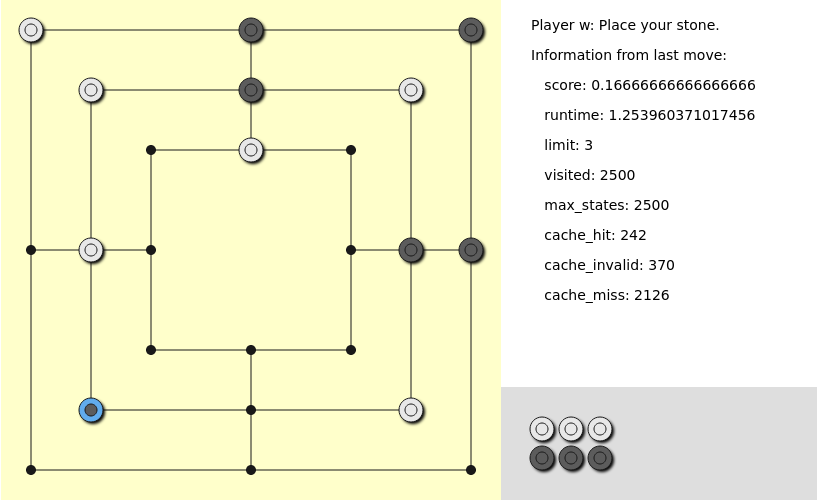

# Künstliche Intelligenz für Mühle

Dieses Repository beinhaltet eine Python Implementierung für eine künstliche Intelligenz, die das Brettspiel Mühle spielen kann.
Hierbei werden die Algorithmen `Minimax` und `Alpha-Beta-Pruning` verwendet.
Als Grundlage dient das [Skript (Kapitel 4 *Playing Games*)](https://github.com/karlstroetmann/Artificial-Intelligence) von Prof. Dr. Karl Stroetmann.

Da dieses Repository die Arbeit von einer Studienarbeit und zwei Hausarbeiten beinhaltet, werden diese im Folgenden genau aufgeschlüsselt.

## Studienarbeit

**Autoren**: @nclskfm, @benfu99 und @jstsddg

**Bewertungsgrundlage**:
* **Notebooks**: [README-studienarbeit.md](README-studienarbeit.md)
* **git tag**: [studienarbeit](https://github.com/nclskfm/dhbw-studienarbeit-muehle/tree/studienarbeit)
* **PDF**: [Studienarbeit.pdf](Studienarbeit.pdf)

## Hausarbeit: Retrograde Analysis

**Autoren**: @nclskfm und @benfu99

**Bewertungsgrundlage**:
* **Notebooks**: [README-hausarbeit-retrograde-analysis.md](README-hausarbeit-retrograde-analysis.md)
* **git tag**: [hausarbeit-retrograde-analysis](https://github.com/nclskfm/dhbw-studienarbeit-muehle/tree/hausarbeit-retrograde-analysis)
* **PDF**: [Hausarbeit-Retrograde-Analysis.pdf](Hausarbeit-Retrograde-Analysis.pdf)

## Hausarbeit: Rote Learning (v2)

**Autoren**: @r-franzke und @jstsddg

**Bewertungsgrundlage**:
* **Notebooks**: [README-hausarbeit-rote-learning.md](README-hausarbeit-rote-learning.md)
* **git tag**: [hausarbeit-rote-learning](https://github.com/nclskfm/dhbw-studienarbeit-muehle/tree/hausarbeit-rote-learning-v2)
