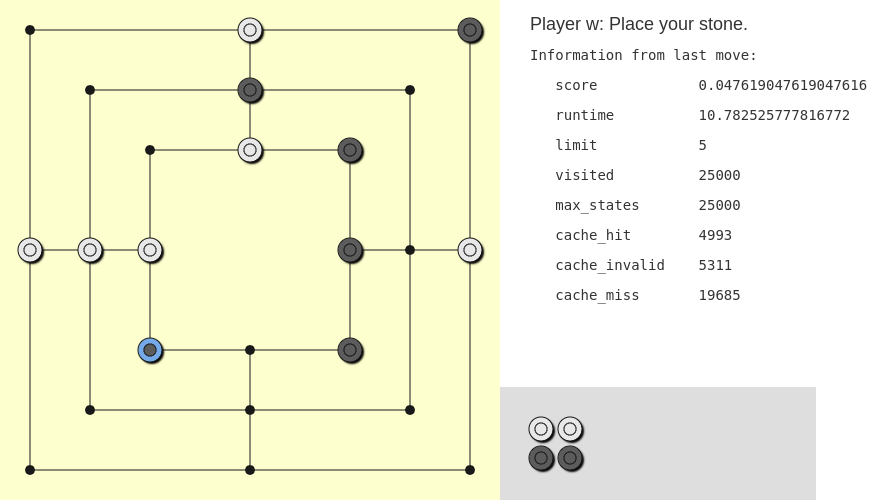

# Künstliche Intelligenz für Mühle

Dieses Repository beinhaltet eine Python Implementierung für eine künstliche Intelligenz, die das Brettspiel Mühle spielen kann.
Hierbei werden die Algorithmen `Minimax` und `Alpha-Beta-Pruning` verwendet.
Als Grundlage dient das [Skript (Kapitel 4 *Playing Games*)](https://github.com/karlstroetmann/Artificial-Intelligence) von Prof. Dr. Karl Stroetmann.

Da dieses Repository die Arbeit von einer Studienarbeit und zwei Hausarbeiten beinhaltet, werden diese hier genau aufgeschlüsselt:

## Studienarbeit

**Authoren**: @nclskfm, @benfu99 und @jstsddg

**Bewertungsgrundlage**:
* **Notebooks**: [README-studienarbeit.md](jupyter/README-studienarbeit.md)
* **git tag**: *ausstehend*
* **PDF**: *ausstehend*

## Hausarbeit: Retrograde Analysis

**Authoren**: @nclskfm und @benfu99

**Bewertungsgrundlage**:
* **Notebooks**: [README-hausarbeit-retrograde-analysis.md](jupyter/README-hausarbeit-retrograde-analysis.md)
* **git tag**: *ausstehend*
* **PDF**: *ausstehend*

## Hausarbeit: Rote Learning

**Authoren**: @r-franzke und @jstsddg

**Bewertungsgrundlage**:
* **Notebooks**: [README-hausarbeit-rote-learning.md](jupyter/README-hausarbeit-rote-learning.md)
* **git tag**: *ausstehend*
* **PDF**: *ausstehend*